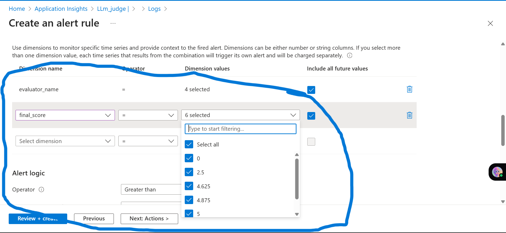
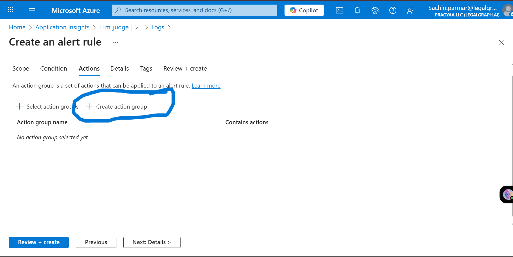

# Introduction

In this lab, we are going to learn how to **set up alerts in the Azure Portal dashboard**. 
Alerts help you monitor the health and performance of your resources by notifying you when specific conditions are met.

## Get Started

Follow the steps below to configure alerts in your Azure Portal dashboard.

## Prerequisites

Before you begin, ensure that you have the following:

- A **Premium Subscription** account in Azure.

- Make sure you have already run the notebook **`Continuously_Evaluate_your_AI_agents_Azure_AI_Foundry.ipynb`**.  
  > 🧪 This lab must be completed before proceeding, as it sets up the necessary components for evaluation and monitoring.

## Let's Get Started

## Let's Get Started

### Step 1: Access Azure Monitor

1. In your **Azure Foundry Monitoring** section, scroll down until you find **Azure Monitor**.
2. Under Azure Monitor, click on **Application Insights**.
3. This will redirect you to the **Azure Portal**.

### Step 2: Open Query from Dashboard

Once you are redirected to the Azure Portal:

1. You will see a dashboard similar to the one in your Foundry environment.
2. Look for the **Open Query** link or button on the dashboard **(highlighted one)**.
3. Click on it to proceed.

### Step 3: Create a New Alert Rule

1. On the right side of the screen, you'll see the **Query and Logs** section.
2. Click on the three vertical dots (...) in the top-right corner of that section.
3. From the dropdown menu, select **New Alert Rule**.

### Step 4: Alert Rule Interface

After selecting **New Alert Rule**, the **Create an alert rule** interface will open.

This interface allows you to define the conditions, actions, and scope of your alert.

### Step 5: Configure Measurement Settings

In the **"Create an alert rule"** interface:

1. Scroll down to the **Measurement** section.
2. Select the appropriate **Measure** you can choose Table rows for right now.
3. Choose the **Aggregation Type** Count.
4. Set the **Aggregation Granularity** (e.g., 1 minute, 5 minutes, etc.) based on your monitoring needs we setup for 2 days.

## Step 6: Design Alert Conditions (Split by Dimension)

- **Set `evaluator_name` to "Select All"**  
  This includes all evaluators in the alert condition.

- **Add a condition for `final_score`**  
  Define a threshold or comparison logic (e.g., `final_score < 0.6`) based on your evaluation criteria.

## Step 7: Set Alert Logic

Once your conditions are defined in the **Split by Dimension** section, configure the **alert logic** to trigger notifications based on your chosen thresholds.

Follow these settings:

- **Alert Logic Operator:**  
  `Less than`

- **Threshold Value:**  
  `4`

- **Frequency of Evaluation:**  
  Every `5 minutes`

> ⏱️ This setup ensures that the system checks evaluation results every 5 minutes and triggers an alert when the metric falls below the defined threshold.

✅ **Example configuration shown below:**  

### ✅ Final Step

After completing the configuration:

- **Click on the `Next Action` button** to proceed and finalize your alert setup.

## Step 8: Create an Action Group

After configuring your alert logic, the next step is to define how you’ll be notified when the alert triggers by creating an **Action Group**.

### 🔹 Steps to Create an Action Group:

1. **Click on `Create Action Group`** to begin the setup.  
   

2. **Enter the `Action Group Name`**  
   This is the internal name for identifying the group.

3. **Set a `Display Name`**  
   This name will appear in the alert notifications.

4. **Select the appropriate `Resource Group`**  
   Choose the Azure resource group where this action group should be created.

5. Once all details are filled in, click on **`Next: Notifications`** to proceed to notification settings.

> 🛎️ Action Groups are critical for defining how alerts will notify users—via email, SMS, push, or webhook.

---

### Step 9: Configure Notifications

1. In the **Notifications** tab, go to the dropdown under **Notification type**.
2. Select **Email/SMS message/Push/Voice** from the options.

This defines how you will be notified when the alert is triggered.

### Step 10: Add Notification Details

1. After selecting **Email/SMS message/Push/Voice**, provide the details:
   - Enter the **Email address** where you want to receive the alert.
   - Optionally, you can also add:
     - **Phone number** for SMS
     - **Mobile app notification**
     - **Voice call**

You can choose any combination based on how you want to be notified.Once all details are filled in, click on **`Next: Actions`** to proceed

> 🔔 **Note:** Make sure to **name your notification point** clearly

## Step 11: Skip Actions and Tags Section

In this step, you can skip optional configurations.

- **Actions Tab:** No additional action setup is required at this point.  
- **Tags Tab:** Tagging is optional and can be left blank unless your organization requires resource tagging for tracking or billing.

### Step 12: Review and Create Alert

1. Once all configurations are complete, go to the **Review + create** tab.
2. Review all the details you’ve entered (scope, condition, action group, notifications, etc.).
3. If everything looks correct, click on the **Create** button to finish setting up your alert.

Your alert rule is now active and will notify you based on the conditions you defined.

### Step 13: Alert Successfully Created

Your alert has now been created based on the condition you provided.

From now on, whenever the trigger condition is met, Azure will automatically send a notification to the **email address** you entered during the notification setup.

This helps you stay informed and take action quickly when important events occur.

 

### Step 13: Disable the Alert (Optional)

If you ever want to disable the alert:

1. Go to the **Alerts** section from the Azure Dashboard.
2. Locate the alert rule you created.
3. Click on it, and then choose **Disable** from the options.

This will stop the alert from triggering without deleting the configuration.

### Step 14: Manage Action Group

To view or modify your action group:

1. Go to the **Action Groups** section from the Azure Portal dashboard.
2. Here, you can:
   - Edit existing action groups
   - Add or remove notification types (email, SMS, etc.)
   - Disable the action group if it's no longer needed

This is useful if you want to update how alerts notify you without creating a new alert rule.

### Step 15: Disable the Alert (Optional)

1. Click on it, then click the **Disable** button at the top.

This will pause the alert without deleting it.

## Conclusion

That's all you need to do to **create an alert in the Azure Dashboard**.

By following these steps, you can:

- ✅ Monitor your resources effectively  
- ✅ Get notified when specific conditions are met  
- ✅ Take quick action based on real-time alerts

---

### 🚀 Next Step

Now, **run Lab 5 again** —  
**`Continuously_Evaluate_your_AI_agents_Azure_AI_Foundry.ipynb`** — to see how the alert works in action.

> 🔁 This will allow you to validate your alert setup in real-time.
