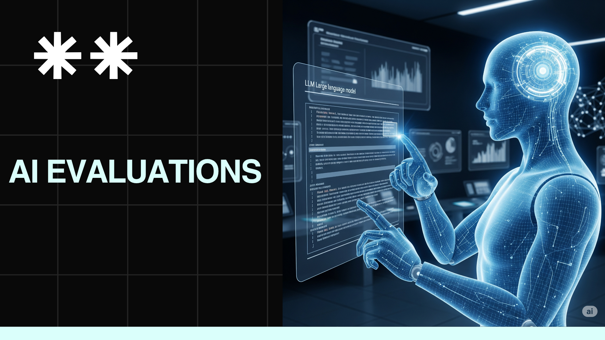

# Hands-On AI: Introduction to AI Evaluations
This is the repository for the LinkedIn Learning course `Hands-On AI: Introduction to AI Evaluations`.  The full course is available on [LinkedIn Learning](https://www.linkedin.com/learning/).

AI evaluation refers to the process of assessing the performance, accuracy, and reliability of AI models designed to generate content, such as text, images, music, or videos. Model evaluation metrics are crucial for assessing AI models to ensure they meet the desired objectives.  
AI evaluation is a critical aspect of machine learning to ensure models perform as expected. Large language models, like GPT, Gemini, or Mistral, are evaluated to ensure that they produce coherent, high-quality outputs that meet the desired objectives without creating harmful or unethical content.

---

## Instructions

This repository does not have any branches. Download the entire repository and you get the exercise files in their final state.

## Lab Folder Structure

- **Lab 1: LLM as Judge**
Learn how to use one AI model to judge another AI model's performance. In this lab, you'll use OpenAI to check how good your LLM responses are. We'll show you how to write prompts that help you figure out if your AI is giving good answers or not.

- **Lab 2: Using Custom Azure AI Evaluators**  
Why write everything from scratch when someone already did the work for you? In this lab, you'll use Azure AI's built-in evaluators like to check the fluency, coherence etc to check your AI models. These evaluators are already trained and ready to use you just need to know how to use them.

- **Lab 3: Continuous Monitoring and Alerting - Keeping an Eye on Your AI 24/7**  
Once your AI is live, you need to watch it like a hawk. This lab shows you how to connect your app to Azure AI Foundry so you can see what's happening in real-time. You'll learn to track how well your AI is doing and set up alerts so you know right away if something goes wrong.

- **Lab 4: AI Red Teaming**  
Master advanced adversarial testing methodologies to identify AI system vulnerabilities and ensure robust performance under challenging conditions. Learn to conduct systematic red team exercises, design edge case scenarios, and implement comprehensive security assessments for production AI systems.

## Installing

To run these labs, you'll need the following:

- A [Google Colab](https://colab.research.google.com/) account  
- An [OpenAI API Key](https://platform.openai.com/api-keys)  
- An **Azure Premium subscription account**

To open any lab:

1. Click on **"Open with Colab"**.
2. The lab will automatically open in your Colab account.
3. From there, you can run the notebook directly.

## Instructor

**Mahesh Yadav**  
*AI Product Manager*
